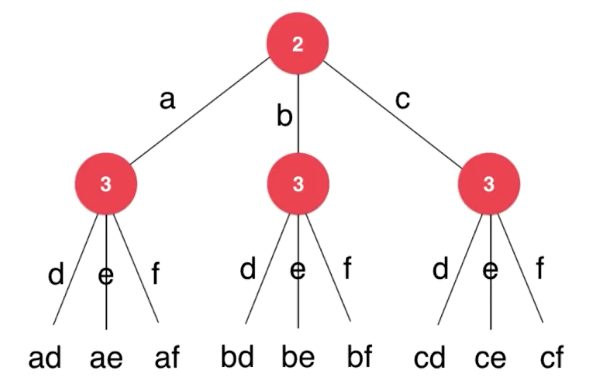

# 递归与回溯

递归与回溯本质是要去解决一种树形问题。<BR>
由于递归回溯本身就是一种抽象的概念，比起纸上谈兵，这里通过例题来讲解

---
## 回溯
## leetcode 17.电话号码的字母组合
给定一个仅包含数字 2-9 的字符串，返回所有它能表示的字母组合。
给出数字到字母的映射如下（与电话按键相同）。


### 示例
> 输入："23"
> 输出：["ad", "ae", "af", "bd", "be", "bf", "cd", "ce", "cf"]



因此我们需要设计的程序就是不断的去试探(dfs)每一种可能的结果，并且在试探之后回到上一层继续寻找可能的结果

部分代码
```java
 private void letterCombinations(HashMap<Character, char[]> map, String digits,String temp,List<String> answer){
        if(temp.length()==digits.length()){
            answer.add(temp);
            return;
        }
        char key = digits.charAt(temp.length());
        char[] wordGroup = map.get(key);
        for(char c:wordGroup){
            String newtemp = temp + c;
            letterCombinations(map,digits,newtemp,answer);
            
        }
    }
```
*map与digits为题目信息，answer为存放最后答案的list，temp是整个程序的主要参数，存放着当前尝试结果。*<BR>

先取出第一个数字表示的字母，之后向下寻找填补之后的数字，当字母长度达到要求保存答案，并回上一次继续尝试，直到根节点可能的尝试全部遍历完成。

**递归回溯的重要特征: 要返回**

**回溯法的效率通常是低下的，它的本质其实是一种暴力解法。我们可以进行适当的剪枝，使用动态规划提升效率**

---

## 分治
## leetcode 131.分割回文串

给定一个字符串 s，将 s 分割成一些子串，使每个子串都是回文串。
返回 s 所有可能的分割方案。

### 示例
> 输入: "aab"
> 输出:
> [
  ["aa","b"],
  ["a","a","b"]
]

```java
public class Solution {
    public List<List<String>> partition(String s) {
        return partitionHelper(s,0);
    }
    private List<List<String>> partitionHelper(String s,int start){
        if(start==s.length()){
            List<String> list = new ArrayList<>();
            List<List<String>> ans = new ArrayList<>();
            ans.add(list);
            return ans;
        }
        List<List<String>> ans = new ArrayList<>();
        for(int i=start;i<s.length();i++){
            if(isPalindrome(s.substring(start, i+1))){
                String left = s.substring(start, i+1);
                for(List<String> l:partitionHelper(s,i+1)){
                    l.add(0,left);
                    ans.add(l);
                }
            }
        }
        return ans;
    }
```


比如aabb这个字符串，我们先在第一个位置切割，形成[a]与[abb] 假如我们能够有一个函数得到后面的全部回文串，我们只需要把a代入即可,[a, a,b,b] [a,a,b]

之后在第二个位置分割，[aa] 并让它加上后面可能的回文结果。[aa,b,b] [aa,bb]<BR>
...<BR>
以此类推,我们就能够得到所有的结果。

**将大问题分解为小问题，利用小问题的结果，解决当前大问题。**<br>


