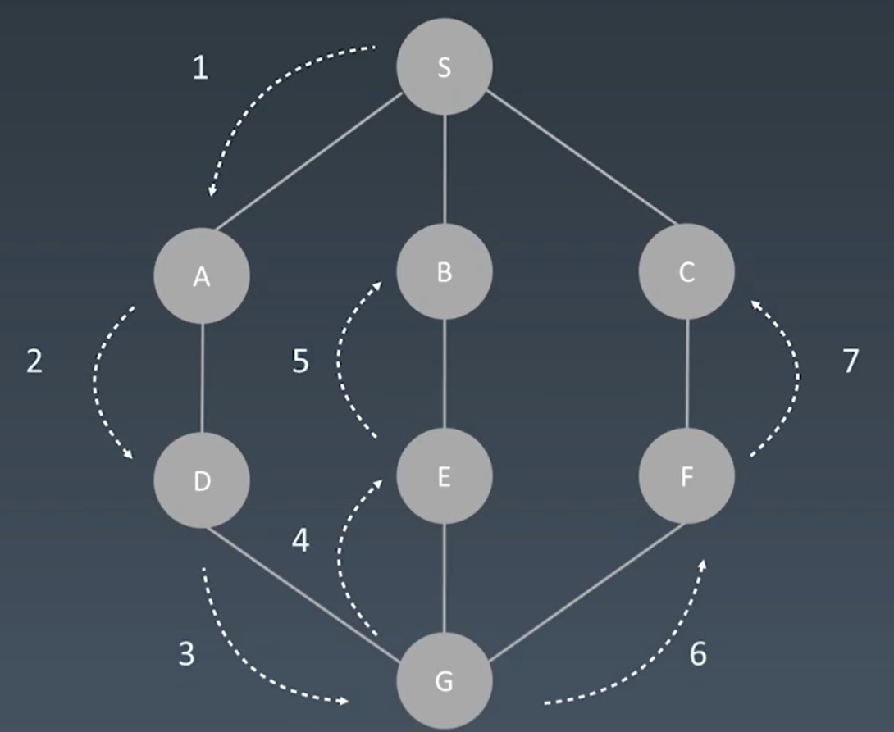
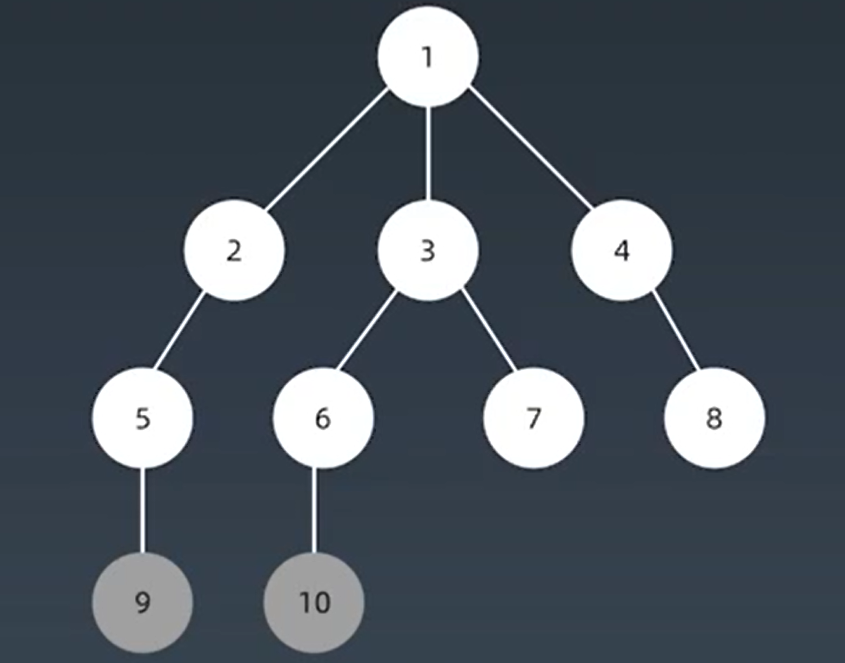

# 第四周学习总结
## 广度优先与深度优先

## 深度优先搜索

即从头开始探索，选择一条路直到走到这条路的尽头为止。在回到分叉路口，继续可能的探索。

*图解*</BR>
</img>


### DFS代码模板(伪)

```python
visited = set()

def dfs(node, visited):
    if node in visited: # 查看该节点时候已经访问过了
    return

    visited.add(node) # 将该节点标记为已经访问

    for next_node in node.children():
        if next_node not in visited:
            dfs(next_node,visited)
```
</BR>

## 广度优先搜索

以起始点为中心逐层搜索需要的结果。如果在图中，广度优先遍历可以在无权图中解决最短路径的问题。广度优先遍历使用队列这种数据结构。

*图解*</BR>
</img>

### BFS代码模板(伪)

```python
def BFS(graph, start, end):
    visited = set()
	queue = [] 
	queue.append([start]) 

	while queue: 
		node = queue.pop() 
		visited.add(node)

		process(node) 
		nodes = generate_related_nodes(node) 
		queue.push(nodes)

	# other processing work 
	...
```

---
## 贪心算法

所谓的贪心算法，就是不断的选择当前的情况下的局部最优解。
贪心算法与动态规划的区别在于贪心对每个子问题都选择当前的最优解，并不能退回。而动态规划是能够退回的。

---

## 二分查找

**二分查找的前提是有序**
### 二分查找代码模板(伪)

```python
left, right=0, len(array)-1
while left<=right:
	mid =(left+right)/2
	if array[mid] == target
		break or return result
	elif array[mid] < targrt
		left = mid + 1
	else:
		right = mid -1 
```
## 作业:
> 寻找一个半有序数组 [4, 5, 6, 7, 0, 1, 2] 中间无序的地方

首先当我们传入的一个半序数组的长度为1或者2时，比如[1] [2,1] 此时的旋转点为索引为0的位置。

其次，让我们传入为一个长度大于等于3的数组时</br>
[2,3,1] 如果 nums[mid]大于nums[mid+1]的情况, 则所在的位置为旋转点<Br>
[3,1,2] 如果 nums[mid-1]大于nums[mid]的情况，则mid-1所在的位置为旋转点<br>

如果[0,mid]为一个顺序排列(nums[0] < nums[mid])，说明我们需要寻找的转折点位于后半部分。反之则在前面。
</br>修改left与right，继续递归。
```java
private int findRotation(int[] nums, int left, int right) {
        if(left-right<2)return left;
        int mid = (int) (left + right) / 2;
        if (nums[mid]>nums[mid+1]) return mid;
        if(nums[mid-1]>nums[mid])return mid-1;
        if(nums[0] < nums[mid]) {
            left = mid+1;
            return findRotation(nums,left,right);
        }else {
            right = mid -1;
            return findRotation(nums,left,right);
        }
    }

    public static void main(String[] args) {
        Solution2 solution2 = new Solution2();
        int a = solution2.findRotation(new int[]{6,7, 0, 1, 2, 4, 5,6});
        System.out.println(a);

    }
```


