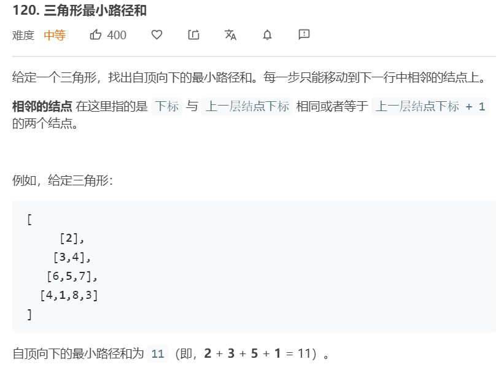

# 第六周学习总结

从一道例题总结递归与动态规划

问题为leetcode第120号问题。三角形最小路径和



## 解法一 纯递归

我们先从纯递归的角度来思考，假如我们现在位于三角形的顶点部分，那么从顶点走到底的最短路径就等于，我们从左下角走下去的最短路径和与右下角的最短路径和中，取出一个最小值，并加上顶点的权重，即可。

假设我们设计出了一个函数findMinPath，在这个函数中输入坐标即可得到最短路径和。那么 f(顶点) = Min(f(左下角)+f(右下角))+所在位置权重。

所以代码可得

```java
public class Solution {
    public int minimumTotal(List<List<Integer>> triangle) {
        int end = triangle.size();
        int res = findMinPath(triangle,0,0,end);
        return res;
    }

    private int findMinPath(List<List<Integer>> triangle,int index,int layers, int end) {
        if(layers==end) return 0;

        int left = findMinPath(triangle,index,layers+1,end);
        int right = findMinPath(triangle,index+1,layers+1,end);
        return triangle.get(layers).get(index)+Math.min(left,right);
    }
}
```

递归的终止条件为，当访问的地方已经超出了原三角形的底边位置则一律返回0。

目前程序的问题在于经过了大量的重复计算。

<br>

## 解法二 带记忆的递归

这次我们使用二维数组来保存已经计算过的值。长宽均为三角形的size的方阵。

```java
public class Solution2 {
    public int minimumTotal(List<List<Integer>> triangle) {
        int end = triangle.size();
        int[][] memo = new int[end][end];
        return findMinPath(triangle,0,0,end,memo);
    }

    private int findMinPath(List<List<Integer>> triangle,int index,int layers, int end,int[][]memo) {
        if(layers==end-1) {
            memo[layers][index] = triangle.get(layers).get(index);
            return memo[layers][index];
        }

        int left,right;
        if(memo[layers+1][index]==0) memo[layers+1][index] = findMinPath(triangle,index,layers+1,end,memo);
        left = memo[layers+1][index];

        if(memo[layers+1][index+1]==0) memo[layers+1][index+1] = findMinPath(triangle,index+1,layers+1,end,memo);
        right = memo[layers+1][index+1];

        return triangle.get(layers).get(index)+Math.min(left,right);
    }
}
```
对递归的终止条件也适当优化，当我们访问到三角形最底一层时，返回最底层权重即可。

<br>

## 解法三 自底向上动态规划

我们可以先设计一个长短都等于三角形大小的方正。让方正的最底端等于给出的对应位置的三角形的权重。
从倒数第二层开始，f[x][y] = f[x-1][y] + f[x-1][y+1]

```java
public class Solution3 {
    public int minimumTotal(List<List<Integer>> triangle) {
        int len = triangle.size();
        int[][] memo = new int[len][len];
        int layer = len-1; //最后一层
        for(int i=0;i<len;i++){
            memo[layer][i] = triangle.get(layer).get(i);
        }
        layer--;
        len--;

        while(layer>=0){
            for(int j=0;j<len;j++){
                memo[layer][j] = Math.min(memo[layer+1][j],memo[layer+1][j+1])+triangle.get(layer).get(j);
            }
            len--;
            layer--;
        }
        return memo[0][0];
    }
}
```

由下往上逐渐填满方正对应的三角部分。顶点的数值即为答案。

## 总结

在递归时，对于自身设计的函数基本语义要清晰，假设我们已经解决了前面的部分子问题，那么我们如果利用已经解决的子问题来解决现在的问题，将是我们递归程序的核心部分。

而动态规划则是一个自底向上的过程，利用动态转移方程逐渐解决问题，由下往上得出答案。